# CityPulse vs Google Maps vs Citizen: Competitive Feature Audit

## Your Moat — What Neither Google Maps Nor Citizen Can Match

CityPulse sits at the intersection of Google Maps (navigation) and Citizen (safety alerts) while having advantages over both:

**vs Google Maps:**

- **Live police scanner transcription** with AI categorization — Google only gets crowdsourced reports; you have the raw feed
- **Incident audio playback** with word-level highlighting — completely unique
- **Safe routing that avoids crime** (not just traffic) with category-based avoidance toggles
- **Auto-reroute on new incidents** — Google reroutes for traffic, you reroute for safety

**vs Citizen:**

- **AI-powered safety scoring** per location — Citizen just shows pins, you quantify risk
- **Safe navigation** — Citizen has zero routing; it tells you what happened, not how to stay safe
- **Ethical guardrails** (inhibitor system) — Citizen has been criticized for racial profiling and fear-mongering; your inhibitor blocks vague "suspicious person" reports
- **Data from scanner, not crowds** — Citizen relies on user reports that can be inaccurate or biased; your data comes directly from police/fire dispatch
- **Analytics dashboard** with time-of-day heatmaps, trends, and neighborhood comparisons — Citizen just shows a feed
- **No deceptive dark patterns** — Citizen uses fear-based engagement tactics (red UI, urgency language, purchase pressure); CityPulse can be the trustworthy alternative

**Your positioning: "Google Maps tells you the fastest way. CityPulse tells you the safest."**

---

## Feature Gap Analysis

### Tier 1: High-Impact, Feasible (implement these)

**1. Share / Permalink (Google Maps has this, you don't)**

- Google Maps lets you share any location, route, or place as a URL
- CityPulse has NO sharing: no URL state, no share button on incidents, no copy-link
- **Recommendation:** Add query params for map position, selected incident, and active filters (`?lat=39.95&lng=-75.16&z=14&incident=abc123&window=6h`). Add a share button on `IncidentDetail` that copies a permalink or opens native Web Share API
- **Citizen comparison:** Citizen lets you share incidents to social — you need this for virality

**2. Push Notifications for Nearby Incidents (Citizen has this, you don't)**

- Citizen's killer feature is "something is happening 3 blocks from you"
- CityPulse has `AlertToast` for new incidents while the app is open, but nothing when closed
- **Recommendation:** Add Firebase Cloud Messaging (FCM) push notifications. Let users set a radius ("alert me for incidents within 0.5mi of home/work"). This could be a Pro feature
- Requires: service worker, FCM setup, backend trigger when new incident is ingested
- **Key differentiator vs Citizen:** Your alerts come from verified scanner data, not unverified user reports

**3. Predictive Safety Scores (Neither has this — your unique advantage)**

- Citizen is purely reactive: it tells you what just happened
- Google Maps predicts traffic but not safety
- **Recommendation:** Use your historical incident data to build time-of-day risk forecasting. "This area is typically safe at 2 PM but has 3x more incidents after midnight." Show it as a color gradient on neighborhood profiles and when planning routes
- Implementation: Aggregate incidents by neighborhood + hour-of-day from your existing analytics data. Display as a 24-hour safety curve on SafetyScoreCard and NeighborhoodProfile

**4. SafeWalk Companion Mode (Citizen has live agents, you can do it better)**

- Citizen Premium ($20/mo): live safety agents you can call, but it's expensive and impersonal
- **Recommendation:** Build a SafeWalk mode where users can share their live walking route with a trusted contact. The contact sees your position on the map in real-time with nearby incidents. Add:
  - "I'm walking home" button that starts live location sharing via a unique link
  - Automatic check-in timer ("tap to confirm you're safe every 10 min")
  - Emergency SOS button that sends location + triggers alert
  - Auto-detect if the user stops moving unexpectedly
- This is FREE and peer-based vs Citizen's $20/mo agent model — massive differentiator

**5. Turn-by-Turn Safety Voice Navigation (Neither has this)**

- CityPulse has route geometry and a TripHUD with ETA, but no voice guidance
- Citizen has zero navigation capability
- **Recommendation:** Add basic voice alerts: "In 200 feet, turn right on Market Street." Use Web Speech API (`speechSynthesis`). Add safety-specific callouts: "Caution: violent incident reported 2 blocks ahead." This is a huge differentiator — no one else does safety voice nav

**6. Incident Verification and Resolution Tracking (Citizen's biggest weakness)**

- Citizen's worst problem: unverified, sensationalized, sometimes false reports with no resolution status
- **Recommendation:** Add verification badges and lifecycle tracking to incidents:
  - "Scanner Verified" badge (from dispatch audio) vs "Unverified" (if you ever add user reports)
  - Status: "Active" / "Units Responding" / "Resolved" / "Cleared"
  - Resolution tracking: "This incident was resolved at 3:45 PM"
- This directly addresses Citizen's #1 user complaint — you never know if something is still happening

### Tier 2: Medium Impact (v2 features)

**7. Saved Places / "My Places" (Google Maps has this, yours is incomplete)**

- Google Maps: Home, Work, starred places, custom labels, visited history
- CityPulse: Has `SavedPlaces` + `useSavedDestinations` but it's not prominent — buried in the directions panel
- **Recommendation:** Promote saved places to a first-class sidebar section. Add "Home" and "Work" quick-set. Show safety score for saved places. "How safe is your commute right now?" as a dashboard widget

**8. Safety Resources POI Layer (Google Maps core feature, you have none)**

- Google Maps: restaurants, gas stations, hospitals, pharmacies, police stations as map layers
- CityPulse: Zero POI data
- **Recommendation:** Add an optional "Safety Resources" layer showing police stations, hospitals, fire stations, and safe havens (24hr businesses, transit hubs). Use Overpass/OSM data (free). This reinforces the safety brand without trying to be a full Google Maps clone

**9. Route Comparison Cards**

- Google Maps shows alternate routes with time differences
- **Recommendation:** Show side-by-side: "Normal route: 12 min" vs "Safe route: 15 min (+3 min, avoids 2 incidents)" with a visual safety delta

**10. Incident Sharing on Social**

- Citizen: comments on incidents, live video, pays users to livestream
- CityPulse: Nothing social
- **Recommendation:** Start simple: "Share this incident" button (Twitter/X, copy link). Consider a "Was this helpful?" upvote/downvote to crowdsource incident accuracy. Do NOT add comments (moderation nightmare) or live video (liability nightmare, and it's what makes Citizen controversial)

**11. Timeline / Travel History**

- Google Maps: where you've been, routes taken
- **Recommendation:** Add a "My Trips" history showing past safe routes taken, incidents you encountered, safety scores along the way. Good Pro feature

### Tier 3: Don't Bother (structural advantages of competitors)

- **3D Immersive Navigation** — requires Google-scale imagery pipeline
- **Crowdsourced incident reporting at scale** — Google processes 10M+ daily reports
- **EV charging / transit schedules** — off-brand for CityPulse
- **Business listings / reviews** — Yelp/Google's domain, not yours
- **Live video broadcasting** — this is what makes Citizen controversial (vigilantism, racial profiling); stay away
- **Paid safety agents** — Citizen charges $20/mo for live agents; SafeWalk with trusted contacts is a better, free alternative

---

## CityPulse vs Citizen: Head-to-Head

| Feature            | Citizen                         | CityPulse (Current)                            | CityPulse (Planned)                  |
| ------------------ | ------------------------------- | ---------------------------------------------- | ------------------------------------ |
| Real-time alerts   | Crowdsourced, unverified        | Scanner-verified, AI-categorized               | + Push notifications                 |
| Navigation         | None                            | Safe routing + auto-reroute                    | + Voice nav with safety callouts     |
| Safety scoring     | None                            | Per-location + per-neighborhood                | + Predictive time-of-day forecasting |
| Walk-home safety   | $20/mo live agents              | None                                           | SafeWalk: free, peer-based, with SOS |
| Incident status    | No resolution tracking          | None                                           | Verified / Active / Resolved badges  |
| Audio              | Premium-only scanner clips      | Free playback with word highlighting           | Same                                 |
| Analytics          | Basic crime trends              | Heatmaps, time grids, neighborhood comparisons | Same                                 |
| Ethical guardrails | None (criticized for profiling) | Inhibitor system blocks vague reports          | Same                                 |
| Pricing            | Free + $20/mo Premium           | Free + $4.99/mo Pro                            | Same                                 |

---

## Mobile Browser Experience (PWA + Responsive)

Before a native app, the mobile web experience should feel native. These are browser-on-phone integrations that require no app store.

### Progressive Web App (PWA)

- **Web App Manifest** (`manifest.json`): app name, icons (192px + 512px), `display: "standalone"`, `theme_color`, `background_color`, `start_url: "/"`. This enables "Add to Home Screen" on both iOS Safari and Android Chrome — the app launches without browser chrome, looks like a native app
- **Service Worker**: Cache the app shell (HTML, JS, CSS, map tiles) for instant load and offline fallback. Show a "You're offline — showing cached incidents" banner when connectivity drops. Use Workbox (built into Next.js) for cache strategies
- **Standalone display mode**: When launched from home screen, hide the URL bar. Use `viewport-fit=cover` + `env(safe-area-inset-*)` CSS to go edge-to-edge behind the notch/Dynamic Island
- `**theme-color` meta tag**: Match the browser chrome (address bar) color to the app header. Switch dynamically for dark mode

### Touch Interactions

- **Swipe-to-dismiss** on incident detail cards and bottom sheet — natural mobile gesture
- **Pull-to-refresh** on the incident feed panel (use `overscroll-behavior` CSS + JS touch events or a library like `react-pull-to-refresh`)
- **Long-press on map** to trigger "How safe is this spot?" — show safety score + recent incidents for the tapped location
- **Pinch-to-zoom** already works on Leaflet, but ensure custom overlays (clusters, HUD) scale correctly
- **48px minimum tap targets** on all interactive elements (incident cards, filter toggles, nav buttons) per WCAG/Google Material guidelines — some current UI elements are too small on phone

### Geolocation & "Near Me" Mode

- **Browser Geolocation API** (`navigator.geolocation.watchPosition`): Show a pulsing blue dot on the map (like Google Maps). Auto-center on load with a "Re-center" floating action button when the user pans away
- **Live incident radius**: "3 incidents within 0.25mi of you" banner at top of mobile view, updating in real-time as new incidents come in or you move
- **Permission UX**: Don't prompt for location immediately on page load — show a "Find incidents near me" button first, then request permission on tap (avoids the hostile permission-on-load pattern)
- **Heading indicator**: Use `DeviceOrientationEvent` to show which direction the user is facing on the map dot (useful during SafeWalk navigation)

### Dark Mode

- `**prefers-color-scheme: dark`** media query: detect system dark mode preference
- **OLED-black map tiles**: Switch to a dark tile provider (CartoDB Dark Matter or Stadia Dark) in dark mode — pure black backgrounds save battery on OLED screens
- **Dynamic `theme-color`**: `<meta name="theme-color" content="#000000" media="(prefers-color-scheme: dark)">`
- **Dark mode toggle** in settings that overrides system preference (light / dark / system)
- All UI components (sidebar, bottom sheet, incident cards, charts) need dark variants

### Screen & Viewport

- **Screen Wake Lock API** (`navigator.wakeLock.request("screen")`): Keep the screen on during active navigation or SafeWalk mode — critical for hands-free walking directions
- **Safe area insets**: `padding: env(safe-area-inset-top)` etc. for iPhone notch, Dynamic Island, and Android camera cutouts. The map should extend behind them, but interactive elements must stay within safe bounds
- **Orientation handling**: Lock to portrait during SafeWalk/navigation if desired, or gracefully reflow the UI in landscape (hide sidebar, full-width map)
- **Viewport meta**: Ensure `<meta name="viewport" content="width=device-width, initial-scale=1, viewport-fit=cover, maximum-scale=1">` — prevent accidental double-tap zoom on the incident feed while allowing pinch-zoom on the map

### Mobile-Specific UI Patterns

- **Floating Action Button (FAB)**: A persistent bottom-right button for the primary action — "Navigate" when viewing an incident, "SafeWalk" on the main map, "Re-center" when panned away from location
- **Haptic feedback** via Vibration API (`navigator.vibrate(200)`) on high-severity incident alerts — brief buzz when a nearby shooting/fire is reported
- **Web Share API** (`navigator.share()`): Native share sheet on mobile for sharing incidents or routes — uses the OS share picker instead of a custom dropdown
- **Compact incident cards**: On screens < 640px, show a condensed card format (category icon + title + time + distance, no description until tapped)
- **Thumb-zone layout**: Keep primary actions (filters, search, navigate) in the bottom half of the screen where thumbs can reach. Move secondary actions (settings, saved places) to top or hamburger menu

### Mobile Browser Notifications

- **Web Notifications API** (separate from FCM push): Request notification permission and show browser notifications for high-severity nearby incidents while the tab is in the background. Works on Android Chrome and desktop, limited on iOS Safari (requires PWA on iOS 16.4+)
- Pair with the service worker for notifications even when the tab is closed (on Android)

---

## Mobile App Strategy

Building a native mobile app unlocks features the web can't do well:

**Why mobile matters:**

- Push notifications work natively (no PWA permission friction)
- Background location for SafeWalk and auto-reroute
- Lock-screen widgets ("Safety near me: 2 incidents in 0.5mi")
- App Store presence for discoverability and credibility
- Haptic feedback for alerts

**Recommended approach: React Native (Expo)**

- Shares business logic and API layer with the Next.js web app
- Single codebase for iOS + Android
- Expo handles push notifications, location, haptics out of the box
- Can embed the Leaflet map via WebView initially, migrate to react-native-maps later
- Expo EAS for builds and OTA updates without App Store review cycles

**Mobile-first features (not feasible on web):**

- Background location tracking for SafeWalk companion mode
- Native push notifications with rich content (map thumbnail, audio snippet)
- Home screen widget showing live incident count + safety score for saved locations
- Apple Watch / Wear OS companion: haptic buzz for high-severity nearby incidents
- Siri / Google Assistant integration: "Hey Siri, is it safe to walk home?"
- Offline incident cache with map tiles for subway/tunnel dead zones
- Camera integration for future user-submitted reports (if you choose to add that)

**Mobile timeline:**

- Phase 1: Expo wrapper around existing web app (WebView) with native push notifications — ship in weeks
- Phase 2: Native map + incident feed + SafeWalk — 2-3 months
- Phase 3: Widgets, watch app, voice assistant — 3-6 months

---

## UI Improvements Inspired by Google Maps

**Current CityPulse UI gaps:**

- **No deep-linking:** Selecting an incident, applying filters, or zooming the map does not update the URL. Refreshing loses all state
- **Hot spots list doesn't link to neighborhood pages:** The sidebar "HOT SPOTS" section shows neighborhood names but they're not clickable links to `/neighborhood/[slug]`
- **Dead code:** `SearchBar.tsx` and floating `RoutePanel.tsx` are unused by `page.tsx` — should be cleaned up
- **Mobile bottom sheet could be better:** Google Maps' bottom sheet is buttery smooth with snap points; CityPulse's is a fixed 55vh panel

**Google Maps UI patterns to adopt:**

- **Bottom sheet with snap points** (peek / half / full) for mobile — replace fixed height
- **Floating action buttons** for key actions (share, navigate, SafeWalk)
- **Search autocomplete** with recent + saved + nearby suggestions
- **Route comparison cards** showing "Normal route: 12 min" vs "Safe route: 15 min (+3 min, avoids 2 incidents)"

---

## Recommended Priority Order

```mermaid
flowchart TD
  P1["Phase 1: Core + Mobile Web Foundation"]
  P2["Phase 2: Engagement + Mobile Browser Polish"]
  P3["Phase 3: Native App + Scale"]

  P1 --> S1["1. Share / Permalink URLs + Web Share API"]
  P1 --> S2["2. PWA Manifest + Service Worker"]
  P1 --> S3["3. Dark Mode (prefers-color-scheme)"]
  P1 --> S4["4. Push Notifications (Web + FCM)"]
  P1 --> S5["5. Incident Verification + Resolution"]

  P2 --> S6["6. Geolocation 'Near Me' + Heading"]
  P2 --> S7["7. Mobile Touch Gestures + 48px Targets"]
  P2 --> S8["8. SafeWalk + Wake Lock + Safe Areas"]
  P2 --> S9["9. Predictive Safety Scores"]
  P2 --> S10["10. Bottom Sheet Snap Points + FAB"]
  P2 --> S11["11. Route Comparison Cards"]

  P3 --> S12["12. Mobile App v1 - Expo WebView + Push"]
  P3 --> S13["13. Safety Resources POI Layer"]
  P3 --> S14["14. Mobile App v2 - Native Map + SafeWalk"]
  P3 --> S15["15. Widgets + Watch App"]
  P3 --> S16["16. Dead Code Cleanup"]
```

**Phase 1** makes CityPulse a shareable, installable PWA that feels native from the browser. **Phase 2** makes it the app you open when walking home at night — location-aware, touch-optimized, screen-always-on — the moment Citizen loses a user forever. **Phase 3** wraps it all in a native app and scales to a platform.