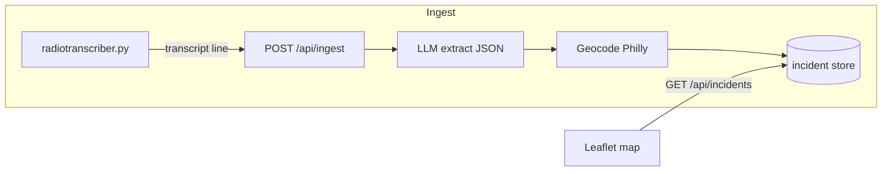

# Philly Pulse — build plan (scanner + LLM only; no crime open-data API)

> **Canonical copy in this repo:** [docs/philly-pulse-plan.md](philly-pulse-plan.md) — keep in sync with work; Cursor may also hold a copy under `~/.cursor/plans/`.

## Data source (locked)

- **Map pins:** **Only** from **Broadcastify stream → [radiotranscriber.py](../radiotranscriber.py) (Whisper) → HTTP ingest → **LLM structured extraction** (required). There is **no** OpenDataPhilly / Carto / PPD bulk crime API in the pipeline.
- **LLM is not optional:** If the API key is missing or the model fails, **do not** silently fall back to another incident source; return a clear error / empty map with explanation.
- **Coordinates:** The LLM should output a human `location_text` (intersection, block, landmark). Resolve to `lat`/`lng` with a **geocoder** (recommended: **OpenStreetMap Nominatim**, restricted to a **Philadelphia bounding box**). That is **not** the same as ingesting a city crime dataset—it turns the transcript-derived place name into a point for the map. If you ever forbid all non-LLM HTTP, the alternative is accepting lat/lng from the model only (high hallucination risk); **not recommended** for a demo.

## Risks / disclaimers (unchanged, stronger)

- Audio + STT + LLM + geocode = **high false positive / wrong-pin** rate. UI must label pins **unverified** and cite **Broadcastify [terms](https://www.broadcastify.com/terms/)** (personal / non-redistribution).
- **Not** real-time 911; **not** official police data.

## What already exists in this repo

- [radiotranscriber.py](../radiotranscriber.py): stream, VAD, faster-whisper, cleanup, log write, optional [mqtt_publisher.py](../mqtt_publisher.py).

## Architecture



## Severity and time decay (heatmap + routing)

This is the concrete version of the “danger fades over time, faster where response is historically quicker” idea, adapted to **scanner + LLM** as the only incident source.

### Time since reported

- Each stored incident has **`reported_at`** (UTC): prefer the **transcriber timestamp** in the ingest body; if missing, use **server receive time**.
- **Age** at display time: $\Delta t$ in **hours** (configurable to minutes for a snappier demo).
- **Recency decay** (exponential — same family as your earlier `exp(-age_hours / …)` idea):

$$W_{\mathrm{time}}(\Delta t) = \exp\left(-\frac{\Delta t}{\lambda_{\mathrm{eff}}}\right)$$

- $\lambda_{\mathrm{eff}}$ = effective time constant (how long a pin stays “hot”). A base **`tau_hours`** in config sets the default scale (e.g. 6–24h for a hackathon demo).

### Severity (LLM + preset category → severity level)

Avoid a free-floating “model picks 1–10.” Use a **closed enum** the LLM must output, then a **deterministic** mapping to numbers (auditable, easy to tune without re-prompting).

1. **LLM JSON** (after marking the line dispatch-relevant):
   - **`severity_category`**, one fixed enum (examples — tune for Philly radio):
     - `violent_weapon`, `violent_no_weapon`, `shots_heard`, `robbery`, `burglary_in_progress`, `medical_priority`, `medical_other`, `fire_hazmat`, `traffic_crash_injury`, `traffic_crash_no_injury`, `disorder`, `admin_or_noise` (usually dropped as non-map noise).
   - Optional **`severity_adjustment`**: only `-1`, `0`, or `+1`, with prompt rules (“0 unless clearly more/less serious than the category default”).
2. **Code** loads `philly_pulse/data/severity_categories.yaml`: each category → **`S_base`** on $[0, 1]$ (or 0–10 then normalized).
3. **Severity $S$** used in the heatmap (before time decay):

$$S = \mathrm{clip}\bigl(S_{\mathrm{base}}(\text{severity\_category}) + k \cdot \text{severity\_adjustment},\, S_{\min},\, S_{\max}\bigr)$$

- $k$, $S_{\min}$, $S_{\max}$ in config (e.g. $k = 0.15$ on a 0–1 scale).

**Net:** the LLM **classifies** into buckets and applies a **small nudge**; **numeric severity is mostly preset**.

### District / response-time fade (ties $\lambda_{\mathrm{eff}}$ to your formula)

Interpretation: pins **lose influence faster** in districts where you assume **quicker typical response**. The app does **not** ingest live per-call response times.

- Lookup **`fade_multiplier`** $F > 0$ from **`dc_dist`** when the LLM (or metadata) supplies a district: `philly_pulse/data/district_fade_multipliers.json`. Values are **precomputed from cited public data** (see below), not guessed at runtime.
- Tie-in:

$$\lambda_{\mathrm{eff}} = \frac{\tau_{\mathrm{hours}}}{F}$$

- **Larger $F$** → **smaller** $\lambda_{\mathrm{eff}}$ → **faster** decay. If unknown district: $F = 1$.

### How response times by area inform fade (public “previous data,” not live inference)

**Goal:** Longer **published** typical response in an area → pin influence should **fade more slowly** (the situation stays “active” longer in the model); **shorter** published response → **faster** fade. That matches “response times from a given area inform how long it takes to fade.”

**Still true:** the **running app does not estimate** response times. It **looks up** $F_d$ from JSON. The **research and math happen once**, before the demo, using **sources you find on the internet** (government PDFs, City Controller / PPD reports, reputable news citing those reports, etc.).

**Offline procedure (required for this project’s narrative):**

1. **Collect $T_d$:** For each PPD **`dc_dist`** (or the finest geography you can map to `dc_dist`), record **published** $T_d$ = mean or median **response time in minutes** (or whatever the report gives — convert consistently). If a report only has citywide or PSA-level data, **document the mapping** (e.g. PSA → district) and any imputation; prefer **under-claim** over precision you cannot cite.
2. **Derive $F_d$** (monotonic with “faster response ⇒ faster fade”). One simple choice:

$$F_d = \frac{T_{\mathrm{median}}}{T_d}$$

where $T_{\mathrm{median}}$ is the **median** of the $T_d$ you have (so typical district gets $F \approx 1$). Then **shorter** $T_d$ ⇒ **larger** $F$ ⇒ **smaller** $\lambda_{\mathrm{eff}}$ ⇒ **faster** exponential decay. **Longer** $T_d$ ⇒ **smaller** $F$ ⇒ **slower** fade. Clip $F_d$ to a sane band (e.g. `[0.5, 1.8]`) so one outlier report does not break the map.
3. **Ship** the result as `philly_pulse/data/district_fade_multipliers.json` including **`_meta`** (or a sibling `philly_pulse/data/district_fade_SOURCES.md`): for each source, **title, publisher, year, URL, and which table/figure** you used. The **UI** should link or summarize: “Fade by district uses published response-time statistics from: … (not live).”

**Implementation note:** Optional small script `philly_pulse/scripts/build_district_fade.py` that reads a hand-maintained CSV (`dc_dist`, `T_minutes`, `source_id`) and writes the JSON + validates clips — or do the calculation in a spreadsheet once and paste JSON; either is fine for Codefest.

**Explicitly out of scope:** Deriving $T_d$ from scanner audio, 911 feeds, or any non-cited scraper at runtime.

**Fallback if no per-district table exists:** Use **one** citywide published statistic plus a **single** breakdown the internet does provide (e.g. a report comparing two regions) and interpolate remaining districts **only** with clear “partial data / uniform default” labeling — still cite the source; do not imply full precision.

### Keeping fade data updated (semi-automatic vs fully automatic)

**Fully automatic** refresh is only realistic if you have a **stable, machine-readable source** that updates on a known cadence (e.g. a recurring **OpenDataPhilly / city dataset** with response times by district, or a fixed **CSV URL** that the city replaces when numbers change). Many controller/audit reports are **PDF-only** or **one-off pages** — there is often **no API**, so “always up to date” without human review is **not** dependable.

**Practical tiers (pick one for the product; document in README):**

1. **Manual + versioned (simplest, safest):** When a new report appears, a human updates the source CSV / `district_fade_SOURCES.md`, runs `build_district_fade.py`, commits new JSON. `_meta.last_built` records the date.
2. **Semi-automatic (recommended):** A **scheduled job** (cron, GitHub Actions weekly) that:
   - **HEAD** or **GET** a **small manifest** you control (e.g. raw JSON in your repo or a gist) listing `source_url`, `content_sha256` or `last_modified`; if unchanged, exit.
   - If a **curated** upstream URL is listed and **ETag/Last-Modified** changed, **download** the new file → run the **same** transform script → write `district_fade_multipliers.json` → open a PR or notify a human to **review** before deploy. Avoid blind trust of scraped PDFs.
3. **“Automatic” only with guardrails:** If the city ever publishes a **documented API** or **stable CSV** for $T_d$ by district, add `philly_pulse/scripts/refresh_district_fade.py` that fetches, validates schema, clips $F_d$, and atomically replaces JSON; log `_meta.fetched_at` and source version. On validation failure, **keep previous** JSON and alert.
4. **Runtime pick-up (optional):** `philly_pulse/server.py` may **reload** `district_fade_multipliers.json` when its file **`mtime`** changes (or every N minutes) so a host cron or sidecar that writes a new JSON updates fade behavior **without** restarting uvicorn.

**Do not:** scrape controller PDFs nightly without human review (layout drift breaks parsers; legal/ToS vary). **Do:** treat automation as **detect change → rebuild → optional human gate**.

### Combined effective weight (per pin)

$$W_{\mathrm{eff}} = S \cdot \exp\left(-\frac{\Delta t}{\lambda_{\mathrm{eff}}}\right) \cdot C$$

- **$C$**: confidence scale from the LLM, e.g. $C = \mathrm{clip}(\texttt{confidence}, 0.3, 1.0)$; default $1$ if omitted.

### “Crime frequency” on the map

There is no separate counter. **Intensity** = **sum of $W_{\mathrm{eff}}$** over incidents that contribute within radius $r$ (or via kernel $K(d)$). More **recent**, **higher-severity**, **higher-confidence**, and **spatially clustered** pins → hotter cells — that is your effective “frequency” signal.

**Routing:** Sample the OSRM walking polyline; at each sample point compute $\sum_i W_{\mathrm{eff},i} K(\mathrm{dist}(p,i))$; optionally flag segments above a threshold.

### Persistence in the store

Persist: `reported_at`, `severity_category`, `severity_adjustment`, `s_base`, `s_final`, `dc_dist`, `fade_multiplier`, `confidence`, optional `weight_at_ingest` for debugging.

## New package layout

| File | Role |
|------|------|
| `philly_pulse/store.py` | Append/list incidents: `id`, `reported_at`, `raw_text`, `severity_category`, `severity_adjustment`, `s_base`, `s_final`, `location_text`, `lat`, `lng`, `dc_dist`, `fade_multiplier`, `confidence`, `geocode_status`, optional `weight_at_ingest`. SQLite under `philly_pulse/data/` or `/tmp`. |
| `philly_pulse/llm.py` | **Required:** strict JSON — `is_dispatch_relevant`, `severity_category` (closed enum), optional `severity_adjustment` in {-1,0,1}, `location_text`, optional `dc_dist`, `confidence`. Reject or no-pin if not relevant. |
| `philly_pulse/geocode.py` | Nominatim `search` with `viewbox`/`bounded=1` for Philly; rate-limit friendly (1 req/s); cache by normalized `location_text`. |
| `philly_pulse/weights.py` | Load `S_base` from YAML; compute $S$, $\lambda_{\mathrm{eff}}$, $W_{\mathrm{eff}}$; helpers for heatmap aggregation and route kernel scoring. |
| `philly_pulse/data/severity_categories.yaml` | Preset **`S_base`** per `severity_category` + rubric text for the LLM prompt. |
| `philly_pulse/data/district_fade_multipliers.json` | **`by_dc_dist` → $F_d$** from published $T_d$; **`_meta.sources`**, **`_meta.last_built`**, optional **`_meta.fetched_at`** if refresh script runs. |
| `philly_pulse/data/district_fade_SOURCES.md` | Human-readable bibliography + how $T_d$ was mapped to `dc_dist` and the formula $F_d = T_{\mathrm{median}}/T_d$ (and clip range). |
| `philly_pulse/scripts/build_district_fade.py` | Read CSV (`dc_dist`, `T_minutes`, `source_id`) → write JSON + validate clips. |
| `philly_pulse/scripts/refresh_district_fade.py` | Optional: if a **stable** upstream URL or manifest exists — fetch, validate, rebuild JSON; else no-op / document manual tier. |
| `philly_pulse/data/philly_broadcastify_feeds.json` | Allowlisted **Philadelphia** Broadcastify `feed_id` values + labels. |
| `philly_pulse/data/BROADCASTIFY_FEEDS.md` | Optional human checklist + verification dates (no scraper). |
| `philly_pulse/routing.py` | OSRM foot route; score using **only** stored pins (same kernel as before). |
| `philly_pulse/server.py` | `POST /api/ingest`, `GET /api/incidents`, `GET /api/health`, `POST /api/route-score`; **optional** reload `district_fade_multipliers.json` on `mtime`/interval. **No Carto client.** |
| `philly_pulse/static/index.html` | Leaflet; disclaimers for scanner+LLM pins; note + link that district fade uses **cited published** response-time stats (not live). |
| `philly_pulse/bridge.py` | Non-blocking `urllib` POST from transcriber to `bridge_url`. |

**Removed from plan:** `philly_pulse/carto_client.py` and any dependency on `phl.carto.com` for incidents.

## Wire transcriber (expected path for map updates)

Extend `config.yaml.example`:

```yaml
philly_pulse:
  enabled: false
  bridge_url: "http://127.0.0.1:8765/api/ingest"
```

In `radiotranscriber.py`, after writing a line to the log, if `philly_pulse.enabled`, **POST** the transcript text in a **daemon thread**.

### Philadelphia-only Broadcastify feed identifiers

**Goal:** Use **only** Broadcastify streams for **Philadelphia** public-safety audio (PPD districts, citywide, fire/EMS as chosen). Store **numeric feed IDs** in-repo so the project is not tied to a random Belchertown example.

**Artifacts:**

- `philly_pulse/data/philly_broadcastify_feeds.json` — curated `{ "feed_id", "label", "verified_date", "notes" }[]`.
- Optional `philly_pulse/data/BROADCASTIFY_FEEDS.md` — same IDs, “last verified,” links to Broadcastify listing pages (for humans, not scraped in CI).

**Population (ToS-safe):** Manually from [broadcastify.com](https://www.broadcastify.com) (e.g. PA → Philadelphia / search “Philadelphia Police”); copy feed ID from the feed URL. **No** automated bulk scraping of Broadcastify in scheduled jobs — risks [terms](https://www.broadcastify.com/terms/) and brittle HTML.

**Config:** `feed_specific.feed_number` in `config.yaml.example` **must** match a `feed_id` in `philly_broadcastify_feeds.json`. Optional: startup check in `radiotranscriber.py` warns if the configured ID is not in the allowlist.

## Dependencies

- `requirements-philly-pulse.txt`: `fastapi`, `uvicorn[standard]`, `httpx` (LLM + Nominatim + OSRM). Transcriber deps unchanged.

## Run commands (README)

```bash
pip install -r requirements-philly-pulse.txt
export OPENAI_API_KEY=...   # required for ingest + map population
uvicorn philly_pulse.server:app --reload --port 8765
python radiotranscriber.py   # with philly_pulse.enabled and Philly-tuned config.yaml
```

## Philly / Codefest pitch (revised)

- **Philly-specific** via **feed + prompt + geocode bbox** (only Philadelphia coordinates accepted or snap-to-city).
- **Responsible AI:** unverified, aggregated cautiously, transparency on pipeline, no official crime claims.

## Verification

- Ingest a synthetic `POST /api/ingest` with realistic dispatch text → LLM returns JSON → geocode returns a Philly point → `GET /api/incidents` shows one pin.
- With transcriber running, confirm new lines create new pins (or “rejected” logs when LLM marks non-relevant).

## Implementation order (when you run in Agent mode)

1. **Data + config:** `severity_categories.yaml`, `philly_broadcastify_feeds.json` (Philly IDs only) + optional `BROADCASTIFY_FEEDS.md`, `district_fade_multipliers.json` + `_meta.sources` / `last_built`, `district_fade_SOURCES.md`, `build_district_fade.py` + sample CSV; document **fade refresh** tier (manual vs scheduled manifest vs future `refresh_district_fade.py`).
2. **Core library:** `store.py` (SQLite schema), `llm.py` (strict JSON, required key), `geocode.py` (Nominatim + Philly bbox), `weights.py` ($S$, $F_d$, $W_{\mathrm{eff}}$).
3. **API + UI:** `server.py` (`POST /api/ingest`, `GET /api/incidents`, `GET /api/health`, `POST /api/route-score`), `routing.py`, `static/index.html` (Leaflet + disclaimers + link to sources doc).
4. **Transcriber bridge:** `bridge.py`, `config.yaml.example` `philly_pulse` block + **feed_number must match** `philly_broadcastify_feeds.json`, optional allowlist warning in `radiotranscriber.py`, non-blocking POST after log write.
5. **Deps + docs:** `requirements-philly-pulse.txt`, README section (run, env vars, Broadcastify terms, “fade from cited public $T_d$”).
6. **Research pass (parallel):** Replace stub $T_d$ / $F_d$ with values + citations from real reports; re-run optional build script; update UI copy if needed.

**To generate code:** use Agent mode and ask to **implement the plan** (or follow this checklist).
